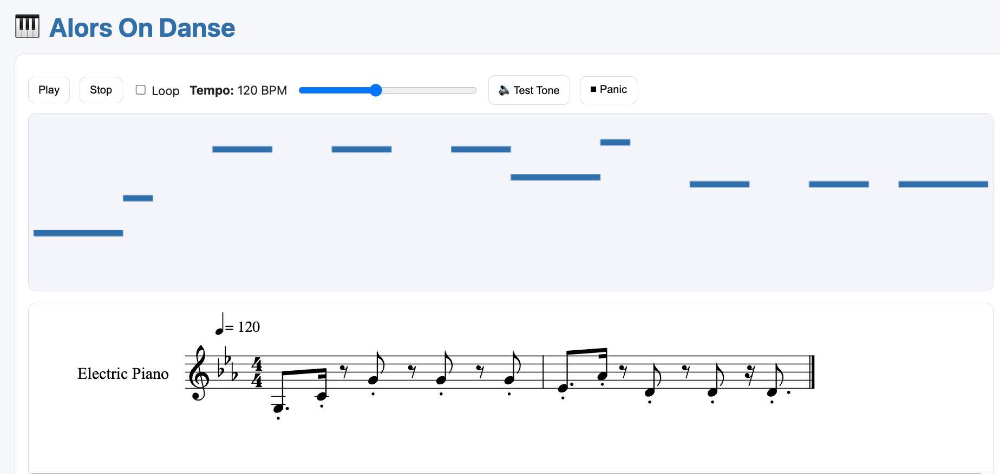

# 🎹 MusicXML/MIDI Visualizer – Interactive Excerpts

This app displays a piano roll, score (via OSMD), and an interactive keyboard.
It supports playback, note highlighting, and several configuration options via URL flags.

👉 Live demo:
[https://adrianartacho.github.io/teach_excerpts/?xml=./scores/alors0.musicxml&title=Alors%20On%20Danse](https://adrianartacho.github.io/teach_excerpts/?xml=./scores/alors0.musicxml&title=Alors%20On%20Danse)



---

## 🚀 Run locally

**Python**

```bash
python3 -m http.server 5500
```

Then open:

```
http://localhost:5500/index.html

http://localhost:5500/index.html?xml=./scores/alors0.musicxml
```

**Node.js**

```bash
npx serve .
```

---

## 📂 Hosting notes

* Keep XML/MIDI files in the same domain to avoid CORS.
  Example: `/scores/alors0.musicxml` → `?xml=./scores/alors0.musicxml`
* For cross-domain hosting, the server must send `Access-Control-Allow-Origin: *`.

---

## 🔧 URL Flags

You can configure behavior by adding query parameters.
Base URL to use for examples:

```
https://adrianartacho.github.io/teach_excerpts/?xml=./scores/alors0.musicxml
```

---

### 🎼 File loading

| Flag         | Example                                                                                         | Description                                                                                             |
| ------------ | ----------------------------------------------------------------------------------------------- | ------------------------------------------------------------------------------------------------------- |
| `xml`        | [link](https://adrianartacho.github.io/teach_excerpts/?xml=./scores/alors0.musicxml), [local](http://localhost:5500/index.html?xml=./scores/alors0.musicxml)            | Load a MusicXML file. `.xml/.musicxml` recommended. `.mxl` will display but not drive playback parsing. |
| `midi`       | [link](https://adrianartacho.github.io/teach_excerpts/?midi=./scores/example.mid), [local](http://localhost:5500/index.html?xml=./scores/example.mid)               | Load a MIDI file.                                                                                       |
| `autoplay=1` | [link](https://adrianartacho.github.io/teach_excerpts/?xml=./scores/alors0.musicxml&autoplay=1), [local](http://localhost:5500/index.html?xml=./scores/alors0.musicxml&autoplay=1) | Attempt to start playback automatically (may be blocked by browser).                                    |

---

### ⏱ Tempo

| Flag      | Example                                                                                      | Description                                                                     |
| --------- | -------------------------------------------------------------------------------------------- | ------------------------------------------------------------------------------- |
| `bpm=120` | [link](https://adrianartacho.github.io/teach_excerpts/?xml=./scores/alors0.musicxml&bpm=111), [local](http://localhost:5500/index.html?xml=./scores/alors0.musicxml&bpm=111) | Override playback tempo. Otherwise, tempo is read from file or defaults to 100. |

---

### 🎹 Keyboard & Range

| Flag              | Example                                                                                                           | Description                                                                                                                         |
| ----------------- | ----------------------------------------------------------------------------------------------------------------- | ----------------------------------------------------------------------------------------------------------------------------------- |
| `low` + `high`    | [link](https://adrianartacho.github.io/teach_excerpts/?xml=./scores/alors0.musicxml&low=C3&high=G5), [local](http://localhost:5500/index.html?xml=./scores/alors0.musicxml&low=C3&high=G5)               | Sets the visible keyboard window. Accepts MIDI numbers or note names (`C3`, `G5`, `F#2`, etc.).                                     |
| `rangeStrict=0`   | [link](https://adrianartacho.github.io/teach_excerpts/?xml=./scores/alors0.musicxml&low=C3&high=G5&rangeStrict=0), [local](http://localhost:5500/index.html?xml=./scores/alors0.musicxml&low=C3&high=G5&rangeStrict=0) | Allows auto-fit to expand the range if needed.                                                                                      |
| `fit=1`           | [link](https://adrianartacho.github.io/teach_excerpts/?xml=./scores/alors0.musicxml&fit=1), [local](http://localhost:5500/index.html?xml=./scores/alors0.musicxml&fit=1)                        | Force auto-fit to notes, ignoring provided range.                                                                                   |
| `transposeVis=12` | [link](https://adrianartacho.github.io/teach_excerpts/?xml=./scores/alors0.musicxml&transposeVis=12), [local](http://localhost:5500/index.html?xml=./scores/alors0.musicxml&transposeVis=12)              | Shifts the **keyboard visualization** (lights + keys) by semitones. Piano roll & audio stay true pitch. Negative values shift down. |

---

### ▶ Playback

| Flag     | Example                                                                                     | Description                       |
| -------- | ------------------------------------------------------------------------------------------- | --------------------------------- |
| `loop=1` | [link](https://adrianartacho.github.io/teach_excerpts/?xml=./scores/alors0.musicxml&loop=1), [local](http://localhost:5500/index.html?xml=./scores/alors0.musicxml&loop=1) | Loop playback enabled by default. |
| `loop=0` | Default                                                                                     | Loop disabled.                    |

---

### 🖥 UI

| Flag             | Example                                                                                             | Description                                            |
| ---------------- | --------------------------------------------------------------------------------------------------- | ------------------------------------------------------ |
| `hideLog=1`      | [link](https://adrianartacho.github.io/teach_excerpts/?xml=./scores/alors0.musicxml&hideLog=1), [local](http://localhost:5500/index.html?xml=./scores/alors0.musicxml&hideLog=1)      | Hides the status log panel.                            |
| `scoreFit=1`     | [link](https://adrianartacho.github.io/teach_excerpts/?xml=./scores/alors0.musicxml&scoreFit=1), [local](http://localhost:5500/index.html?xml=./scores/alors0.musicxml&scoreFit=1)     | Fits the score to container width (re-fits on resize). |
| `scoreZoom=1.25` | [link](https://adrianartacho.github.io/teach_excerpts/?xml=./scores/alors0.musicxml&scoreZoom=1.25), [local](http://localhost:5500/index.html?xml=./scores/alors0.musicxml&scoreZoom=1.25) | Explicit zoom factor (overrides `scoreFit`).           |

---

### 📛 Title

| Flag                                        | Example                                                                                                                        | Description                                     |
| ------------------------------------------- | ------------------------------------------------------------------------------------------------------------------------------ | ----------------------------------------------- |
| `title=Alors%20On%20Danse`                  | [link](https://adrianartacho.github.io/teach_excerpts/?xml=./scores/alors0.musicxml&title=Alors%20On%20Danse), [local](http://localhost:5500/index.html?xml=./scores/alors0.musicxml&title=Alors%20On%20Danse)                  | Replaces the text part of the title (🎹 stays). |
| `titleFull=1&title=🎵%20Alors%20On%20Danse` | [link](https://adrianartacho.github.io/teach_excerpts/?xml=./scores/alors0.musicxml&titleFull=1&title=🎵%20Alors%20On%20Danse), [local](http://localhost:5500/index.html?xml=./scores/alors0.musicxml&titleFull=1&title=🎵%20Alors%20On%20Danse) | Overrides the entire `<h1>` including emoji.    |

---

## 📥 Embedding

```html
<iframe
  src="https://adrianartacho.github.io/teach_excerpts/?xml=./scores/alors0.musicxml&title=Alors%20On%20Danse"
  width="110%"
  height="1000"
  style="border:0; max-width:1000px; width:100%; display:block; margin:0 auto;"
  allow="autoplay"
  loading="lazy"
></iframe>
```

---

## 👉 To-Do

* Don't play tied notes
* light-up score as well
